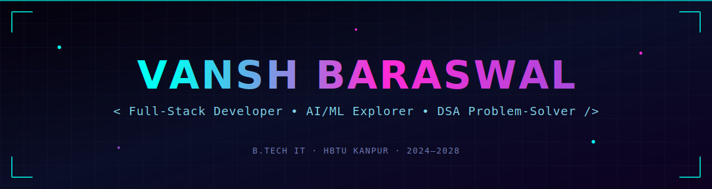
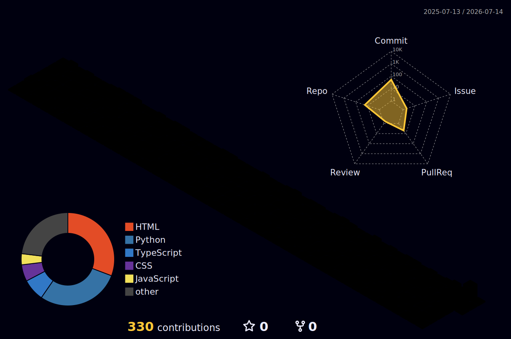

<div align="center">



<br/>

<a href="https://linkedin.com/in/vansh-baraswal"></a>
<a href="mailto:vanshbaraswal22@gmail.com"></a>
<a href="https://github.com/VanshBaraswal22"></a>

<br/><br/>


<br/><br/>


</div>

<br/>


## 👤 SYSTEM.PROFILE



```yaml
identity:
  name: Vansh Baraswal
  role: Full-Stack Developer | AI-ML Explorer
  university: HBTU Kanpur (B.Tech IT, 2024–2028)
  status: "Actively building & leveling up 🚀"

focus:
  - Full-stack apps → React · Node.js · Express · MongoDB
  - Backend systems → Django · REST APIs
  - ML fundamentals → Python · Pandas · NumPy
  - DSA grind → 350+ problems solved and climbing

currently:
  contributing_to: GirlScript Summer of Code
  exploring: Machine Learning & System Design
  open_to: Collaboration, Hackathons, Internships
```

<br clear="right"/>


## ⚙️ TECH STACK // NEURAL MAP

<div align="center">

<table>
<tr><td align="center" width="100%">

**Languages**


**Frontend**


**Backend & Data**


**Problem Solving**


**Tools & Deploy**


</td></tr>
</table>

</div>

<br/>

<div align="center">

</div>

<br/>


## 🚀 FEATURED BUILD

<div align="center">

<table width="100%">
<tr>
<td align="center" style="padding: 28px;">


### 🔮 GridSage AI

#### ⚡ Electricity Demand Forecasting Engine


<br/><br/>

A collaborative research build that models electricity demand using time-series forecasting — engineered on synthetic hourly data with seasonal and peak-hour patterns baked in.

<br/>

| ⚡ MODULE            | 📝 DETAILS                                                                             |
| :------------------- | :------------------------------------------------------------------------------------- |
| **Data Engineering** | Cleaned & feature-engineered synthetic hourly datasets with seasonal/peak-hour signals |
| **Modeling**         | Train-test splitting + baseline ML models for demand prediction & evaluation           |
| **Collaboration**    | Contributed to shared research documentation & team dev workflow                       |

<br/>

`Python` `Pandas` `NumPy` `Machine Learning` `Time-Series Analysis`

</td>
</tr>
</table>

</div>

<br/>


## 📡 LIVE ANALYTICS FEED

<div align="center">


<br/>


</div>

<br/>

## 🌐 3D CONTRIBUTION MATRIX

<div align="center">



<sub>⚙️ Auto-generated daily via GitHub Actions — isometric 3D render of real commit activity</sub>

</div>

> ⚠️ **This image only appears after you run the workflow once.** It doesn't exist in your repo yet — GitHub Actions generates it the first time you trigger it (Actions tab → GitHub-Profile-3D-Contrib → **Run workflow**). See setup steps below.

<br/>

## 🐍 NEURAL CONTRIBUTION SNAKE

<div align="center">

</div>

<br/>


## 📶 TRANSMISSION CHANNEL

<div align="center">

Always down to collaborate on **full-stack builds, DSA challenges, or ML experiments**.
Open a channel — hackathon team, project collab, or just a tech conversation.

<a href="https://linkedin.com/in/vansh-baraswal"></a>
<a href="mailto:vanshbaraswal22@gmail.com"></a>

<br/><br/>


**⚡ [VanshBaraswal22](https://github.com/VanshBaraswal22) — end of transmission.**

</div>
