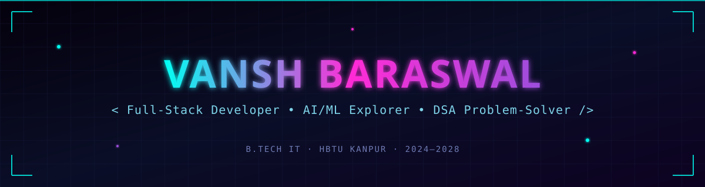
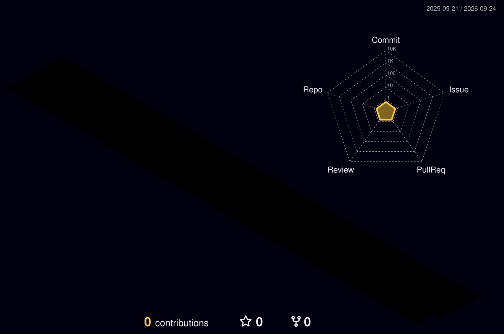

<div align="center">



<br/>

<a href="https://linkedin.com/in/vansh-baraswal"></a>
<a href="mailto:vanshbaraswal22@gmail.com"></a>
<a href="https://github.com/VanshBaraswal22"></a>

<br/><br/>


<br/><br/>


</div>

<br/>


## 👤 SYSTEM.PROFILE



```yaml
identity:
  name: Vansh Baraswal
  role: Full-Stack Developer
  university: HBTU Kanpur (B.Tech IT, 2024–2028 )
  status: "Actively building & leveling up 🚀"

focus:
  - Full-stack apps → React · Node.js · Express · MongoDB · MySQL
  - REST APIs → JWT Auth · Socket.IO · Webhooks
  - Data & AI tools → Python · Pandas

currently:
  contributed_to: GirlScript Summer of Code (GSSoC 2026)
  interned_at: 1M1B (Green Skills & Applied AI) · SkillNexis (Full Stack MERN)
  open_to: Collaboration, Hackathons, Internships
```

<br clear="right"/>


## ⚙️ TECH STACK // NEURAL MAP

<div align="center">

<table>
<tr><td align="center" width="100%">

**Languages**


**Frontend**


**Backend & Data**


**Data & AI Tools**


**Tools**


</td></tr>
</table>

</div>

<br/>

<div align="center">

</div>

<br/>


## 🚀 FEATURED BUILDS

<div align="center">

<table width="100%">
<tr>
<td align="center" style="padding: 28px;">


### ⚙️ FlowOps

#### Industrial Operations Workflow Platform


<br/><br/>

A full-stack platform for visually creating and managing simulated industrial workflows for equipment alerts, inspections, and maintenance activities — with configurable triggers, conditional steps, JWT auth, webhook-based events, and real-time execution monitoring via Socket.IO.

<br/>

`React` `Node.js` `Express.js` `MongoDB` `React Flow` `Socket.IO` `JWT`

</td>
</tr>
</table>

<br/>

<table width="100%">
<tr>
<td align="center" style="padding: 28px;">


### 🔮 GridSage AI

#### Electricity Demand Forecasting Engine


<br/><br/>

A collaborative research build that models electricity demand using time-series forecasting — engineered on synthetic hourly data with seasonal and peak-hour patterns baked in.

<br/>

| ⚡ MODULE            | 📝 DETAILS                                                                             |
| :------------------- | :------------------------------------------------------------------------------------- |
| **Data Engineering** | Cleaned & feature-engineered synthetic hourly datasets with seasonal/peak-hour signals |
| **Modeling**         | Train-test splitting + baseline ML models for demand prediction & evaluation           |
| **Collaboration**    | Contributed to shared research documentation & team dev workflow                       |

<br/>

`Python` `Pandas` `NumPy` `Machine Learning` `Time-Series Analysis`

</td>
</tr>
</table>

<br/>

<table width="100%">
<tr>
<td align="center" style="padding: 28px;">


### 🔁 ShiftSwap

#### Employee Shift Exchange Platform


<br/><br/>

Lets employees view assigned shifts, request shift swaps, and track request status. Approval workflow supports pending, approved, rejected, and cancelled states through an interactive React dashboard, backed by MySQL.

<br/>

`React` `Node.js` `Express.js` `MySQL` `JWT`

</td>
</tr>
</table>

<br/>

<table width="100%">
<tr>
<td align="center" style="padding: 28px;">


### 📋 Project Management Dashboard

#### MERN Kanban-Style Task Tracker


<br/><br/>

MERN-based dashboard for creating projects, organizing tasks, and tracking progress through a Kanban-style interface — with REST APIs, MongoDB persistence, JWT auth, and drag-and-drop task organization.

<br/>

`React` `Node.js` `Express.js` `MongoDB` `JWT`

</td>
</tr>
</table>

</div>

<br/>


## 🌐 3D CONTRIBUTION MATRIX

<div align="center">



<sub>⚙️ Auto-generated daily via GitHub Actions — isometric 3D render of real commit activity</sub>

</div>

<br/>

## 🐍 NEURAL CONTRIBUTION SNAKE

<div align="center">

</div>

<br/>


## 🏆 ACHIEVEMENTS

<div align="center">


</div>

<br/>


## 📶 TRANSMISSION CHANNEL

<div align="center">

Always down to collaborate on **full-stack builds or ML experiments**.
Open a channel — hackathon team, project collab, or just a tech conversation.

<a href="https://linkedin.com/in/vansh-baraswal"></a>
<a href="mailto:vanshbaraswal22@gmail.com"></a>

<br/><br/>


**⚡ [VanshBaraswal22](https://github.com/VanshBaraswal22) — end of transmission.**

</div>
